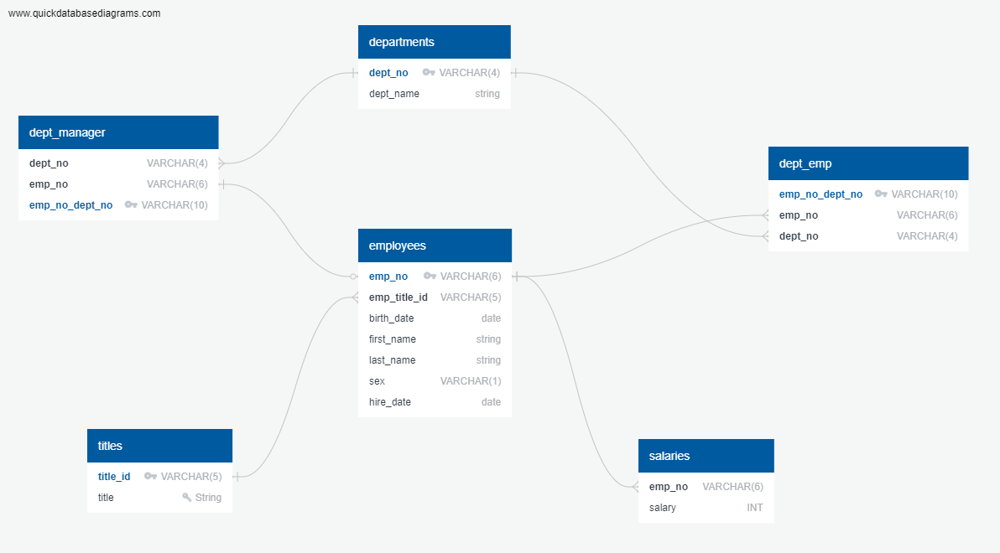

# Employee Database


- ## Overview
  - The overall goal of this project is to bring a company's legacy database system into the modern age and perform an analysis. All that remains of this database from the 1980's are 6 CSV files. You've been asked to create a SQL database from these spreadsheets and use database queries to perform an analysis, fulfilling specific requests.

- ## Steps deployed to reach goal
    - Step 1 : Sketch ERD using [Quick DBD](http://www.quickdatabasediagrams.com)
    - Step 2 : Use ERD to create table schema and load tables
    - Step 3 : Create queries to perform analysis, answering specific questions

- ##  ERD
    #### *created visualization of table schema to assist with creating schema*
    
    
- ##  Requested Analysis
    ##### *specific request and the queries used to fulfill them:*

  1. List the following details of each employee: employee number, last name, first name, sex, and salary.
      ```SQL
      SELECT
        e.emp_no AS "Employee Num",
        e.last_name AS "Last Name",
        e.first_name AS "First Name",
        e.sex AS "Gender",
        s.salary AS "Salary"
      FROM employees_tb AS e
      LEFT join salaries_tb AS S ON
      e.emp_no = s.emp_no;
      ``` 
  2. List first name, last name, and hire date for employees who were hired in 1986.
      ```SQL
      SELECT
        first_name AS "First Name",
        last_name AS "Last Name",
        hire_date AS "Hire Date"
      FROM employees_tb
      Where hire_date > '1986-01-01'::date
      AND hire_date < '1986-12-31'::date;
      ```   
  3. List the manager of each department with the following information: department number, department name, the manager's employee number, last name, first name.
      ```SQL
      SELECT
        d.dept_no as "Department Num",
        d.dept_name AS "Department Name",
        dm.emp_no AS "Managers Employee Number",
        em.last_name AS "Managers Last Name",
        em.first_name AS "Managers First Name"
      FROM departments_tb AS d
      LEFT JOIN dept_manager_tb as dm
      ON d.dept_no = dm.dept_no
      JOIN employees_tb as em 
      on dm.emp_no=em.emp_no
      ``` 
  4. List the department of each employee with the following information: employee number, last name, first name, and department name.
      ```SQL
      SELECT 
        em.emp_no AS "Employee Number",
        em.last_name AS "Last Name",
        em.first_name AS "First Name",
        de.dept_no AS "Department Number",
        dp.dept_name AS "Department Name"
      FROM employees_tb AS em
      LEFT JOIN dept_emp_tb AS de
      ON em.emp_no = de.emp_no
      LEFT JOIN departments_tb AS dp
      ON de.dept_no=dp.dept_no;
      ``` 
  5. List first name, last name, and sex for employees whose first name is "Hercules" and last names begin with "B."
      ```SQL
      SELECT e.first_name, e.last_name, e.sex FROM employees_tb AS e
      WHERE e.first_name = 'Hercules' AND e.last_name LIKE 'B%';
      ``` 
  6. List all employees in the Sales department, including their employee number, last name, first name, and department name.
      ```SQL
      SELECT 
        e.emp_no AS "Employee Number",
        e.last_name AS "Last Name",
        e.first_name AS "First Name",
        dp.dept_name AS "Department Name"
      FROM employees_tb AS e
      JOIN dept_emp_tb AS de
      ON e.emp_no=de.emp_no
      JOIN departments_tb AS dp
      ON de.dept_no=dp.dept_no
      WHERE dp.dept_name = 'Sales';
      ``` 
  7. List all employees in the Sales and Development departments, including their employee number, last name, first name, and department name.
      ```SQL
      SELECT 
        e.emp_no AS "Employee Number",
        e.last_name AS "Last Name",
        e.first_name AS "First Name",
        dp.dept_name AS "Department Name"
      FROM employees_tb AS e
      LEFT Join dept_emp_tb AS de
      ON e.emp_no = de.emp_no
      LEFT JOIN departments_tb AS dp
      ON de.dept_no = dp.dept_no
      WHERE (dp.dept_name = 'Sales') OR (dp.dept_name ='Development')
      ORDER BY e.first_name ASC;
      ``` 
  8. In descending order, list the frequency count of employee last names, i.e., how many employees share each last name.
      ```SQL
      SELECT last_name AS "Last Name", (SELECT COUNT(last_name) AS "Number of Employees") FROM employees_tb
      GROUP BY last_name
      ORDER BY last_name DESC;
      ``` 

- ## Programs, Languages and Tools
  - SQL
  - Postgres
  - [Quick DBD](http://www.quickdatabasediagrams.com)

- ## File overview
  - ### ERD
    ##### *basic text file of initial schema from the [Quick DBD](http://www.quickdatabasediagrams.com) website*
  - ### schema.sql
    ##### *this file contains the commands that build the basic structure of the SQL tables*
  - ### query.sql
    ##### *this SQL file contains all the queries used to answer the questions for the analysis*
  - ### Data Folder
    ##### *contains the 6 original CSV files*
